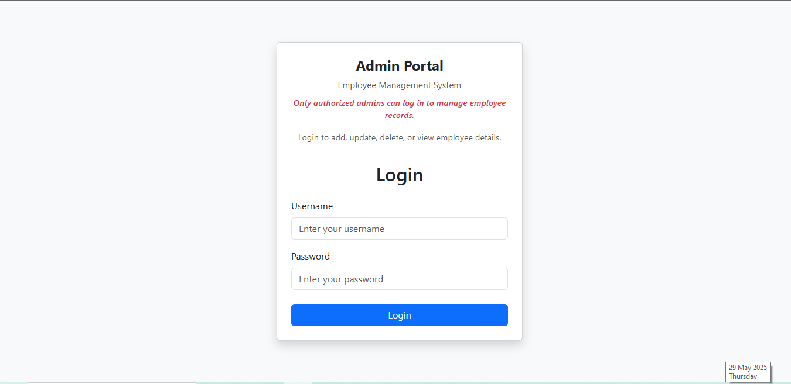
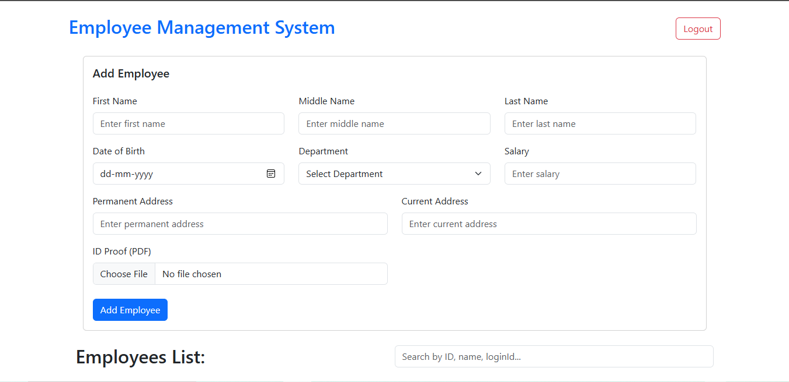
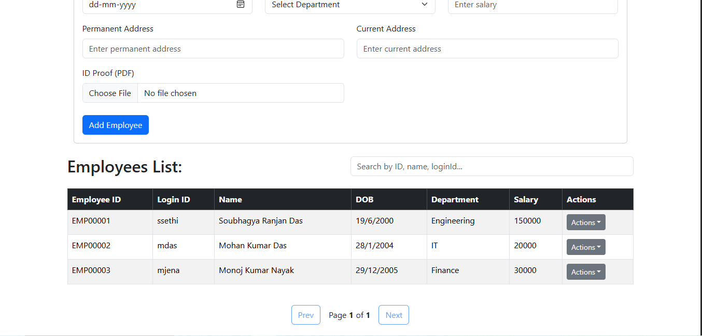
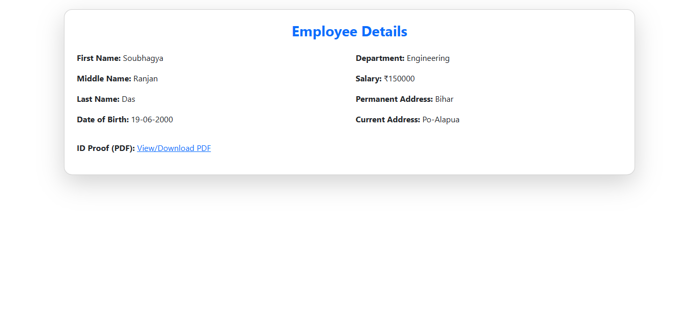

# 🧑‍💼 Employee Management Tool

A complete Employee Management System built using the MERN stack with features like login (admin only), full CRUD operations, employee detail viewing, and filtering based on name, department, and date of birth.

---

## 🔥 Features

- 🔐 **Admin Login Only**
- ➕ **Add New Employees**
- 📋 **View Employee List**
- 🔍 **View Single Employee Details**
- ✏️ **Update Employee Information**
- ❌ **Delete Employees**
- 🧠 **Filtering Employees**
  - By **Name**
  - By **Department**
  - By **Date of Birth**
- 📁 Upload ID Proof (PDF)
- 🎯 Responsive UI using **React-Bootstrap**

---

## 🛠️ Tech Stack

**Frontend:**
- React.js
- React Router DOM
- React-Bootstrap
- Axios

**Backend:**
- Node.js
- Express.js
- MongoDB
- Mongoose

**Other Tools:**
- Bootstrap 5
- dotenv
- concurrently (for dev scripts)

---

## 🖥️ Screenshots

> You can find all screenshots in the `screenshots/` folder.

| Login Page | Employee Addition Form | Employee List | View Employee |
|------------|----------------|----------------|
|  |  |  |  |

---

## 🚀 Getting Started

### Clone the repo

git clone https://github.com/your-username/employee-management-tool.git
cd employee-management-tool
---
Install dependencies
For Backend
  cd server
  npm install
For Frontend
  cd frontend
  npm install
---
Create a .env file inside backend/ with the following:
  PORT=5000
  MONGO_URI=your_mongodb_connection_string
  JWT_SECRET=your_secret_key

npm run dev
Frontend runs on http://localhost:3000
node server.js
Backend runs on http://localhost:5000
